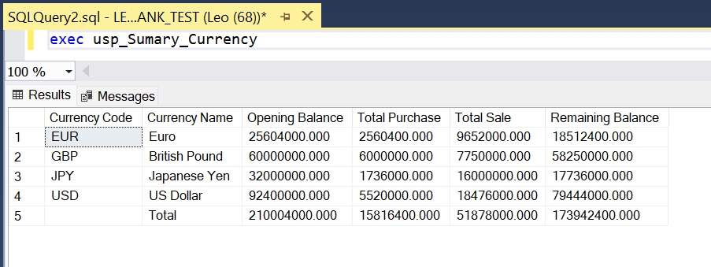
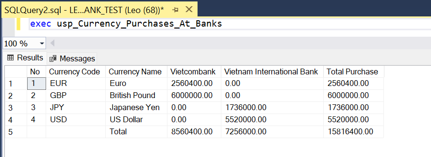
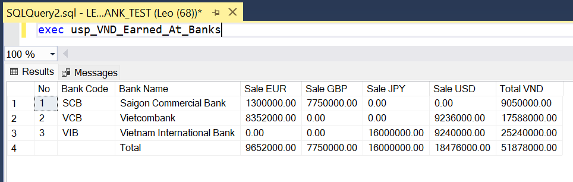
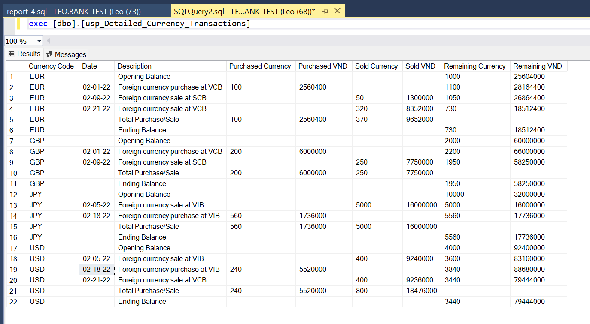

# SQL Currency Management System

This repository contains SQL scripts designed to create and manage a simple database for handling foreign currency transactions and summaries. The database includes the following key functionalities

## Database Overview

The system manages foreign currencies, bank details, transaction records, and opening balances. It includes tables for storing currency information, bank details, transaction logs, and currency opening balances.

### Key Components:
- **Currency Table**: Stores information about different currencies such as currency code and name.
- **Bank Table**: Contains data related to different banks.
- **CurDoc and CurDocDetail Tables**: Capture transaction records for foreign currency purchases and sales at various banks.
- **CurOpen Table**: Holds the opening balance for each currency.

## Indexes and Constraints
The database includes unique clustered indexes to ensure data integrity and optimize query performance:
- **Unique Clustered Index on CurrencyCode**: Ensures that each currency code is unique and provides fast retrieval of currency records.

## SQL Queries for Reports

The provided SQL script includes a series of queries designed to generate financial reports based on the currency transactions:

- **Currency Summary (report_1)**: Provides a summary of the opening balance, purchases, and sales for each currency, including the final balance after transactions.
    
- **Bank Purchase Report (report_2)**: Summarizes the total amount of foreign currency purchased at different banks.
    
- **VND Revenue from Sales (report_3)**: Generates a report on VND earned from foreign currency sales at different banks.
    
- **Detailed Transaction Report (report_4)**: Provides a detailed log of each currency transaction, including opening balance, purchases, sales, and remaining balance.
    

## Usage

- The SQL script is designed for use in a Microsoft SQL Server environment.
- To use the script, simply run it in your SQL Server Management Studio (SSMS) or another SQL Server-compatible tool.

## Technical skills
- Database schema
- Query data structure, get familiar with writing procedures
- Dinamic SQL: write string structure syntax to automatically execute queries
- Pivot data structure: dynamic column mapping 
